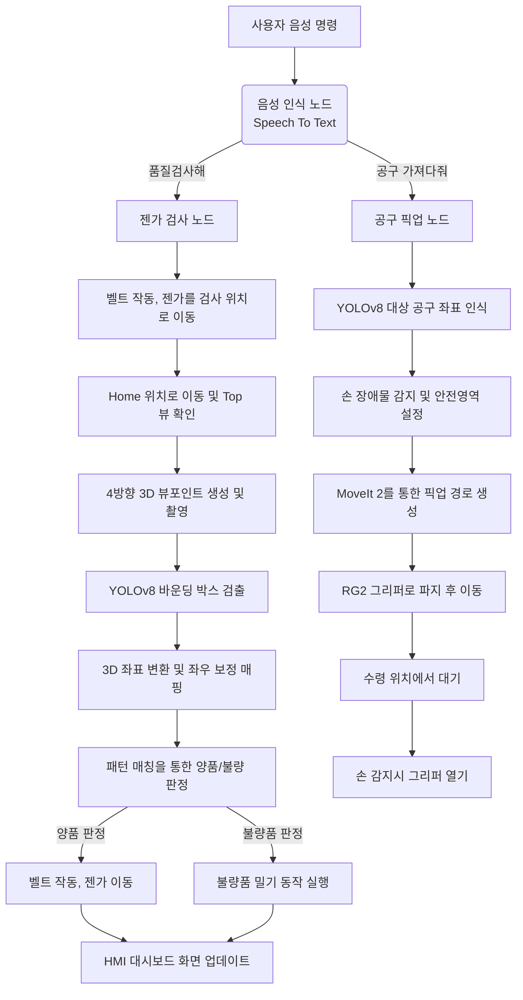

# 🤖 Collaborative Robot Assistance and Quality Inspection System
조 이름:A-2조
팀명: k3j1

**A-2조**의 본 프로젝트는 두산 협동 로봇(m0609), 3D 비전 카메라, 그리고 음성 인식을 활용하여 **공구 픽업, 그리고 젠가 품질 검사**를 수행하는 통합 시스템입니다.

---

## 🌟 1. 주요 기능
- **🎙️ 음성 인식 제어 (HRI):** 사용자의 음성 명령("품질검사해", "해머 가져다줘")을 인식하여 로봇의 동작을 제어합니다.
- **🔍 3D 비전 기반 품질 검사:** 로봇이 젠가 탑을 4방향에서 회전하며 스캔하고, YOLOv8 모델과 3D 깊이 센서를 이용해 빈 구멍(불량품)을 정확히 찾아냅니다.
- **🛠️ 스마트 공구 픽업/배송:** 작업자가 요구하는 공구(해머, 드라이버 등)를 비전으로 인식한 후, 실시간으로 3D 좌표를 추정하여 안전하게 집고 목표 위치(또는 컨베이어)로 배송합니다.
- **🛡️ 실시간 장애물 회피:** 작업자의 손이 작업 영역에 들어오면 YOLO로 인식하여 MoveIt 충돌 회피(Collision Object) 영역을 즉시 생성, 사고를 방지합니다.
- **📊 웹 기반 HMI 대시보드:** FastAPI와 Frontend 웹앱을 연동하여 실시간으로 카메라 영상, 검사 결과, 로봇 상태 및 통계를 모니터링합니다.

---

## 🏛️ 2. 시스템 설계 및 플로우 차트

아래는 음성 명령을 시작으로 두 가지 핵심 작업(품질 검사 / 공구 배송)이 이루어지는 과정입니다.



---

## 💻 3. 운영체제 환경
- **OS:** Ubuntu 22.04 LTS (Jammy Jellyfish)
- **Middleware:** ROS 2 Humble Hawksbill
- **Language:** Python 3.10, Node.js (HMI)

---

## ⚙️ 4. 사용한 장비 목록
- **로봇 암 (Robot Arm):** Doosan Robotics m0609 (두산 m0609)
- **그리퍼 (Gripper):** OnRobot RG2
- **3D 카메라 (Camera):** Intel RealSense D435i / D435Y
- **마이크 (Microphone):** 노트북 내장 마이크 (음성 인식용)
- **기타:** 시리얼 통신 제어 컨베이어 벨트, 아두이노, 스텝 모터 드라이버

---

## 📦 5. 주요 의존성 (Dependencies)
Python 관련 주요 패키지 목록입니다. (상세 내용은 `requirements.txt` 또는 `package.xml` 참고)
- `ultralytics` (YOLOv8 비전 처리)
- `opencv-python` (이미지 프로세싱)
- `pyrealsense2` (리얼센스 카메라 깊이 데이터 연동)
- `SpeechRecognition`, `PyAudio` (음성 인식)
- `fastapi`, `uvicorn`, `pydantic` (백엔드 웹 서버)
- `pyserial` (컨베이어 시리얼 제어)

---

## 🚀 6. 실행 순서 (Launch Sequence)
시스템을 개별적으로 켜지 않고, 최상위 경로의 `start_all.sh` 스크립트를 통해 **Terminator 기반 12분할 창**으로 자동 실행됩니다. 

내부적인 노드 실행 순서 및 스크립트는 다음과 같습니다.

1. **카메라 구동:** `ros2 launch realsense2_camera rs_align_depth_launch.py` (RGB-D 정렬)
2. **로봇 드라이버 및 MoveIt:** 
   - `ros2 launch m0609_rg2_bringup bringup_camera.launch.py mode:=real`
   - `ros2 launch m0609_rg2_moveit movegroup_only.launch.py`
3. **YOLO 비전 모델 노드:** 
   - `ros2 run object_detection jenga_detection` (젠가 인식)
   - `ros2 run object_hand object_hand` (손 장애물 인식)
4. **로직 제어 및 HRI 노드:**
   - `ros2 run object_hand hand_obstacle_publisher` (장애물 회피 영역 퍼블리싱)
   - `ros2 run robot_control jenga_inspector` (젠가 품질 검사 메인)
   - `ros2 run voice_processing get_keyword` (음성 명령 대기)
   - `python3 tool_pick_yolo_target.py` (공구 픽업 메인)
5. **HMI 웹서버 구동:**
   - FastAPI 백엔드 (`uvicorn app.main:app`) 및 Frontend (`npm run dev`)
6. **컨베이어 제어:** `python3 conveyor_control.py`

**실행 방법:**
```bash
cd ~/ws_cobot2_pjt
./start_all.sh
```
실행이 완료되면 브라우저에서 `http://localhost:5173` 으로 HMI 대시보드에 접속할 수 있습니다.
